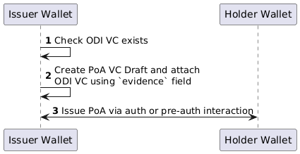
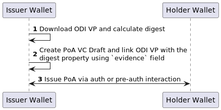

# RFC: Embedded ODI in PoA

### Authors

* https://github.com/MartinRobomaze/
* https://github.com/marosrbm/
* Yiorgos

### Collaborators

* https://github.com/cklugow/

### Timeline

Created: 2024-11-20
Last updated: 2024-11-20

### Approvers

*

## Overview

Power of Attorney (PoA) was introduced to suit the representation purpose. In order to achieve this it needs to be
coupled with the organization for which the Organizational Digital Identifier is used. In practice, a company nominee should be able to present
with the PoA credential along with ODI so that the verifier can check not only the PoA validity but also the validity of the ODI and the link between these two.

## Credential schemas

### ODI
Issued by a Business Registry (EBSI RTAO/TAO) issuer to a specific Company. The company can be the owner of an enterprise or a personal wallet.  The subject contains the company DID.

Schema:
https://api-pilot.ebsi.eu/trusted-schemas-registry/v3/schemas/zFMNrfecxyCEaLgpusf9CP5aq651BpWUV4BM9x8KXxzNY

### PoA
Issued by a Company to a natural person. The subject contains natural person's DID (did:key).

Schema:
https://api-pilot.ebsi.eu/trusted-schemas-registry/v2/schemas/z2sbTT23X2zfsdMCPFMC7GiUwyHE91Lg9BpeEA5uqtT9s

## Embedding ODI VC

PoA schema extends the base [EBSI Attestation schema](https://api-pilot.ebsi.eu/trusted-schemas-registry/v2/schemas/0xeb6d8131264327f3cbc5ddba9c69cb9afd34732b3b787e4b3e3507a25d3079e9)
which defines the `evidence` property (see the [VC DM specification](https://www.w3.org/TR/vc-data-model-2.0/#evidence) for more details). This field will be used to embed a Verifiable Attestation of the ODI credential.

The embeded PoA VC schema is in accordance with the EBSI's suggested [Authorisation Delegation](https://www.npmjs.com/package/@cef-ebsi/vcdm2.0-delegated-authorisation-schema?activeTab=code) schema

### Prerequisites

The wallet needs to hold a valid ODI verifiable credential.

### PoA Issuance

Before PoA gets issued the issuer wallet needs to first check if a valid ODI VC exists in its storage. The ODI VC will get included in the PoA draft and just after that the issuance interaction may begin.

#### Example of PoA VC with ODI VC embedded:
```json
{
  "@context": [
    "https://www.w3.org/2018/credentials/v1"
  ],
  "credentialSchema": {
    "id": "https://api-pilot.ebsi.eu/trusted-schemas-registry/v3/schemas/z2sbTT23X2zfsdMCPFMC7GiUwyHE91Lg9BpeEA5uqtT9s",
    "type": "FullJsonSchemaValidator2021"
  },
  "credentialStatus": {
    "id": "https://api-conformance.ebsi.eu/trusted-issuers-registry/v5/issuers/did:ebsi:zzhg8kdpKQ1svP7w5hkGZqf/proxies/0x45f01de57aeff6389c482b93c15f44aa58331bb8274dcefb02893745c2686a9d/status/0#0",
    "statusListCredential": "https://api-conformance.ebsi.eu/trusted-issuers-registry/v5/issuers/did:ebsi:zzhg8kdpKQ1svP7w5hkGZqf/proxies/0x45f01de57aeff6389c482b93c15f44aa58331bb8274dcefb02893745c2686a9d/status/0",
    "statusListIndex": "0",
    "statusPurpose": "revocation",
    "type": "StatusList2021Entry"
  },
  "credentialSubject": {
    "dateOfBirth": "1979-11-11",
    "familyName": "YOGI",
    "firstName": "BEAR",
    "id": "did:key:z2dmzD81cgPx8Vki7JbuuMmFYrWPgYoytykUZ3eyqht1j9Kbs5am9syyRGgTSgdrRFLmQeWbFXN9TLw2x5V2HTtZjKgD9iP6iXxAouKZXHHSV3HFnpKX65grm14mx5XJ9daMy22rzRCKxEwjwucNyKibAhaxHX3zEbYyeyPma4e2f4MVD6",
    "nationality": "SVK",
    "poaScope": false,
    "poaType": [
      "Driving company vehicles"
    ]
  },
  "id": "urn:uuid:f1464e6a-c794-4546-a33d-163e482bf02f",
  "issuanceDate": "2024-11-26T15:24:05.394Z",
  "issued": "2024-11-26T15:24:05.394Z",
  "issuer": "did:key:zBhBLmYmyihtomRdJJNEKzbPj51o4a3GYFeZoRHSABKUwqdjiQPY2g3mGSNj8hkg1897eBinpqHQNw9rVh69CvC95SkUnkND2TqP6RXr8vNjiESUmAwXY81BRB4LSZJ2Dg1Ud7PF8X5n8ZTbreoFdZkGvhi6AbboYgFzue9QCR8QSP27UmV5YxC",
  "type": [
    "VerifiableCredential",
    "VerifiableAuthorisation",
    "PowerOfAttorney"
  ],
  "validFrom": "2024-11-26T15:24:05.394Z",
  "validUntil": "2024-12-26T15:24:05.394Z",
  "evidence": [{
    "id": "urn:uuid:ad30da7b-a1cb-424f-b19a-efd458a1f865",
    "type": "RepresentativeDelegation", 
    "jwt": "eyJhbGciOiJFUzI1NiIsImtpZCI6ImRpZDp......kWRIKcFKwt4XR2nxI9GsqxRx9iCInkk0Pz6WPg"
  }]
}
```

#### Process of PoA issuance:


[puml diagram](poa_issuance_embedded_odi.puml)

## Embedding ODI as link

PoA schema extends the base [EBSI Attestation schema](https://api-pilot.ebsi.eu/trusted-schemas-registry/v2/schemas/0xeb6d8131264327f3cbc5ddba9c69cb9afd34732b3b787e4b3e3507a25d3079e9)
which defines the `evidence` property (see the [VC DM specification](https://www.w3.org/TR/vc-data-model-2.0/#evidence) for more details). The evidence field will be used
to add a link to ODI VP that is published online. The evidence field should also add digest property so that the verifier may check if the linked document is the same.

### Prerequisites

* ODI VP published via publicly available URL

### PoA Issuance

Before the issuance process the issuer needs to know the ODI VP public URL. Ideally, the issuer should check if the ODI subject points to the issuer wallet DID to make sure
the PoA credential is issued with correct ODI VP. The issuer constructs the `evidence` field containing the link to the ODI VP and digest property
containing a hash of the ODI VP.

#### Example of PoA VC with ODI VP linked:

```json
{
  "@context": [
    "https://www.w3.org/2018/credentials/v1"
  ],
  "credentialSchema": {
    "id": "https://api-pilot.ebsi.eu/trusted-schemas-registry/v3/schemas/z2sbTT23X2zfsdMCPFMC7GiUwyHE91Lg9BpeEA5uqtT9s",
    "type": "FullJsonSchemaValidator2021"
  },
  "credentialStatus": {
    "id": "https://api-conformance.ebsi.eu/trusted-issuers-registry/v5/issuers/did:ebsi:zzhg8kdpKQ1svP7w5hkGZqf/proxies/0x45f01de57aeff6389c482b93c15f44aa58331bb8274dcefb02893745c2686a9d/status/0#0",
    "statusListCredential": "https://api-conformance.ebsi.eu/trusted-issuers-registry/v5/issuers/did:ebsi:zzhg8kdpKQ1svP7w5hkGZqf/proxies/0x45f01de57aeff6389c482b93c15f44aa58331bb8274dcefb02893745c2686a9d/status/0",
    "statusListIndex": "0",
    "statusPurpose": "revocation",
    "type": "StatusList2021Entry"
  },
  "credentialSubject": {
    "dateOfBirth": "1979-11-11",
    "familyName": "YOGI",
    "firstName": "BEAR",
    "id": "did:key:z2dmzD81cgPx8Vki7JbuuMmFYrWPgYoytykUZ3eyqht1j9Kbs5am9syyRGgTSgdrRFLmQeWbFXN9TLw2x5V2HTtZjKgD9iP6iXxAouKZXHHSV3HFnpKX65grm14mx5XJ9daMy22rzRCKxEwjwucNyKibAhaxHX3zEbYyeyPma4e2f4MVD6",
    "nationality": "SVK",
    "poaScope": false,
    "poaType": [
      "Driving company vehicles"
    ]
  },
  "id": "urn:uuid:f1464e6a-c794-4546-a33d-163e482bf02f",
  "issuanceDate": "2024-11-26T15:24:05.394Z",
  "issued": "2024-11-26T15:24:05.394Z",
  "issuer": "did:ebsi:zzhg8kdpKQ1svP7w5hkGZqf",
  "type": [
    "VerifiableCredential",
    "VerifiableAuthorisation",
    "PowerOfAttorney"
  ],
  "validFrom": "2024-11-26T15:24:05.394Z",
  "validUntil": "2024-12-26T15:24:05.394Z",
  "evidence": [{
    "id": "https://wallet.dev.triveria.io/api/v1/linked-vp/cd6c7fce-ac09-11ef-a8a2-0a58a9feac02/urn:uuid:d6e49478-a25a-4f56-81c1-4272fae14f32?hl=zQmdE2wDRDBhkxk44PP2hGNhL4PeBDe5sQfXJk6h9DY6tzj",
    "type": ["LinkedVerifiablePresentation", "OrganizationalDigitalIdentifier"],
    "name": "ACME, Inc",
    "digestMultibase": "uELq9FnJ5YLa5iAszyJ518bXcnlc5P7xp1u-5uJRDYKvc"
  }]
}
```

See more on the `digestMultibase` at:
* https://w3c.github.io/vc-data-integrity/vocab/security/vocabulary.html#digestMultibase
* https://www.w3.org/TR/vc-data-integrity/#dfn-digestmultibase

#### Process of PoA issuance:



[puml diagram](poa_issuance_linked_odi.puml)

## PoA Verification

TBD