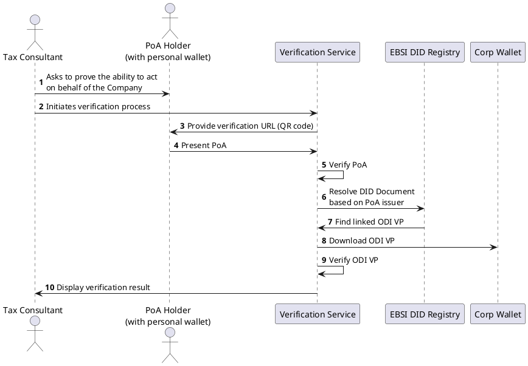

# RFC: Published ODI

### Authors

* https://github.com/MartinRobomaze/
* https://github.com/marosrbm/

### Collaborators

* https://github.com/cklugow/

### Timeline

Created: 2024-09-20
Last updated: 2024-12-02

### Approvers

*

## Overview

The main motivation is to demonstrate the verification process of Power of Attorney (PoA). To do so effectively,
the verification process needs to also provide verified info about the Company for which the
Organizational Digital Identifier (ODI) is issued. This also implies that there needs to be a link between the ODI and PoA.

The end user experience should start with presenting PoA by a natural person that holds it. The verification UI should then
display the result which includes information from PoA and ODI and the verification process result.

## Credential schemas

### ODI
Issued by a Business Registry (EBSI RTAO/TAO) issuer to a specific Company (EBSI TI). The subject contains the company DID.

Schema:
https://api-pilot.ebsi.eu/trusted-schemas-registry/v2/schemas/zFMNrfecxyCEaLgpusf9CP5aq651BpWUV4BM9x8KXxzNY

### PoA
Issued by a Company (EBSI TI) to a natural person. The subject contains natural person's DID (did:key).

Schema:
https://api-pilot.ebsi.eu/trusted-schemas-registry/v2/schemas/z2sbTT23X2zfsdMCPFMC7GiUwyHE91Lg9BpeEA5uqtT9s

## ODI Publishing

As this use case requires a validation of two credentials with a specific assertion made between them, the approach is to publish the ODI in a way that a verifier may resolve its public location based on the data from PoA.

ODI is published as a VP available via a public endpoint provided by the Company wallet.

Example of such ODI VP:
```
eyJhbGciOiJFUzI1NiIsImtpZCI6ImRpZDprZXk6ejJkbXpEODFjZ1B4OFZraTdKYnV1TW1GWXJXUGdZb3l0eWtVWjNleXFodDFqOUticG9qTHc3cExjRGlYTmMzanF0U3ZVWm1kQ1JDN0t1NEE4Q0Yzckg1NkM0ZTU5c3JIbmtaWEFQZWFROWhFOHFkY01acVZEWjF1ZGY3d2Y5R1lDZG13VFd2b1o1aTRTYldMN2lIVFc5NWNpVngxcFluVjNad1BxeXB2ZzlyRjRCa05CRSN6MmRtekQ4MWNnUHg4VmtpN0pidXVNbUZZcldQZ1lveXR5a1VaM2V5cWh0MWo5S2Jwb2pMdzdwTGNEaVhOYzNqcXRTdlVabWRDUkM3S3U0QThDRjNySDU2QzRlNTlzckhua1pYQVBlYVE5aEU4cWRjTVpxVkRaMXVkZjd3ZjlHWUNkbXdUV3ZvWjVpNFNiV0w3aUhUVzk1Y2lWeDFwWW5WM1p3UHF5cHZnOXJGNEJrTkJFIiwidHlwIjoiSldUIn0.eyJpYXQiOjE3MzA4NDIyOTgsImlzcyI6ImRpZDplYnNpOnoyNVpueVc5ZnZpUXJqanJQMXc4RnFHYSIsIm5iZiI6MTczMDg0MjI5OCwic3ViIjoiZGlkOmVic2k6ejI1Wm55VzlmdmlRcmpqclAxdzhGcUdhIiwidnAiOnsiQGNvbnRleHQiOlsiaHR0cHM6Ly93d3cudzMub3JnLzIwMTgvY3JlZGVudGlhbHMvdjEiXSwiaWQiOiJ1cm46dXVpZDphYjNlNDljMi0yNWUzLTQyMDctYmM0NC1kOGQyMTdlZDc0NGEiLCJ0eXBlIjpbIlZlcmlmaWFibGVQcmVzZW50YXRpb24iXSwiaG9sZGVyIjoiZGlkOmVic2k6ejI1Wm55VzlmdmlRcmpqclAxdzhGcUdhIiwidmVyaWZpYWJsZUNyZWRlbnRpYWwiOlsiZXlKaGJHY2lPaUpGVXpJMU5pSXNJbXRwWkNJNkltUnBaRHBsWW5OcE9ucHZPVlkwUmtOTE9VTnBTM1ZYVVUxd2RXSk5la0UwSXpCNGF6QlpVemhRV1VZeFRtRklaa3haUnpONE1FWm1aMkkzWDFKc1EwbGxiMlZ3WHpaUlpUUkllbFVpTENKMGVYQWlPaUpLVjFRaWZRLmV5SmxlSEFpT2pFM016STVPVFV6TmpNc0ltbGhkQ0k2TVRjek1EUXdNek0yTXl3aWFYTnpJam9pWkdsa09tVmljMms2ZW04NVZqUkdRMHM1UTJsTGRWZFJUWEIxWWsxNlFUUWlMQ0pxZEdraU9pSjFjbTQ2ZFhWcFpEcG1NakU1TVRnMk15MHhaVGN3TFRRNU0yRXRPV0k0TlMxaU1qQmpNR00yWkRRek9XUWlMQ0p1WW1ZaU9qRTNNekEwTURNek5qTXNJbk4xWWlJNkltUnBaRHBsWW5OcE9ub3lOVnB1ZVZjNVpuWnBVWEpxYW5KUU1YYzRSbkZIWVNJc0luWmpJanA3SWtCamIyNTBaWGgwSWpwYkltaDBkSEJ6T2k4dmQzZDNMbmN6TG05eVp5OHlNREU0TDJOeVpXUmxiblJwWVd4ekwzWXhJbDBzSW1OeVpXUmxiblJwWVd4VFkyaGxiV0VpT25zaWFXUWlPaUpvZEhSd2N6b3ZMMkZ3YVMxd2FXeHZkQzVsWW5OcExtVjFMM1J5ZFhOMFpXUXRjMk5vWlcxaGN5MXlaV2RwYzNSeWVTOTJNaTl6WTJobGJXRnpMM3BHVFU1eVptVmplSGxEUldGTVozQjFjMlk1UTFBMVlYRTJOVEZDY0ZkVlZqUkNUVGw0T0V0WWVIcE9XU0lzSW5SNWNHVWlPaUpHZFd4c1NuTnZibE5qYUdWdFlWWmhiR2xrWVhSdmNqSXdNakVpZlN3aVkzSmxaR1Z1ZEdsaGJGTjBZWFIxY3lJNmV5SnBaQ0k2SW1oMGRIQnpPaTh2ZDJGc2JHVjBMbVJsZGk1MGNtbDJaWEpwWVM1cGJ5OWhjR2t2ZGpFdmFYTnpkV1Z5TDJNM1lUVm1PVGsxTFRrM05tVXRNVEZsWmkwNE56aGtMVEJoTlRoaE9XWmxZV013TWk5emRHRjBkWE12TUNNd0lpd2ljM1JoZEhWelRHbHpkRU55WldSbGJuUnBZV3dpT2lKb2RIUndjem92TDNkaGJHeGxkQzVrWlhZdWRISnBkbVZ5YVdFdWFXOHZZWEJwTDNZeEwybHpjM1ZsY2k5ak4yRTFaams1TlMwNU56WmxMVEV4WldZdE9EYzRaQzB3WVRVNFlUbG1aV0ZqTURJdmMzUmhkSFZ6THpBaUxDSnpkR0YwZFhOTWFYTjBTVzVrWlhnaU9pSXdJaXdpYzNSaGRIVnpVSFZ5Y0c5elpTSTZJbkpsZG05allYUnBiMjRpTENKMGVYQmxJam9pVTNSaGRIVnpUR2x6ZERJd01qRkZiblJ5ZVNKOUxDSmpjbVZrWlc1MGFXRnNVM1ZpYW1WamRDSTZleUpwWkNJNkltUnBaRHBsWW5OcE9ub3lOVnB1ZVZjNVpuWnBVWEpxYW5KUU1YYzRSbkZIWVNJc0ltbHpjM1ZwYm1kQmRYUm9iM0pwZEhsT1lXMWxJam9pVWxSQlR5SXNJbWx6YzNWcGJtZERiM1Z1ZEhKNUlqb2lVMVpMSWl3aWJHVm5ZV3hHYjNKdElqb2lTVzVqSWl3aWJHVm5ZV3hPWVcxbElqb2lRVU5OUlNKOUxDSnBaQ0k2SW5WeWJqcDFkV2xrT21ZeU1Ua3hPRFl6TFRGbE56QXRORGt6WVMwNVlqZzFMV0l5TUdNd1l6WmtORE01WkNJc0ltbHpjM1ZoYm1ObFJHRjBaU0k2SWpJd01qUXRNVEF0TXpGVU1UazZNelk2TURNdU5EUTBXaUlzSW1semMzVmxaQ0k2SWpJd01qUXRNVEF0TXpGVU1UazZNelk2TURNdU5EUTBXaUlzSW1semMzVmxjaUk2SW1ScFpEcGxZbk5wT25wdk9WWTBSa05MT1VOcFMzVlhVVTF3ZFdKTmVrRTBJaXdpZEhsd1pTSTZXeUpXWlhKcFptbGhZbXhsUTNKbFpHVnVkR2xoYkNJc0lsWmxjbWxtYVdGaWJHVkJkSFJsYzNSaGRHbHZiaUlzSWs5eVoyRnVhWHBoZEdsdmJtRnNSR2xuYVhSaGJFbGtaVzUwYVdacFpYSWlYU3dpZG1Gc2FXUkdjbTl0SWpvaU1qQXlOQzB4TUMwek1WUXhPVG96Tmpvd015NDBORFJhSWl3aWRtRnNhV1JWYm5ScGJDSTZJakl3TWpRdE1URXRNekJVTVRrNk16WTZNRE11TkRRMFdpSjlmUS5IRTQ2THl5MUVKQ1ZzZFc5TWkxT3pwYkkwNGF3cmRXQzhtN3hGcFBIS3Zpa0E2T1J1R1I5STFVTVV1cWNBS3hEeTI4SDdqTk9GU2JNMzYzeGFBTnZmUSJdfX0.Tqf0dYNHbCwY60ZL5uQQJ8qIpLwdknHuWLfw0y2jIF27ej2giAQgh97y-gFPSr-ZjBvZ07oe6R1x83989VgDCQ
```

### DID Document

As the character of the DID Document is public and may be resolved via the Company DID, it seemed like good option for publishing the ODI VP link. This also addresses GDPR requirements as the data is published by the Company itself. On the other hand this approach has some limitations, i.e. if the Company no longer provides the public endpoint for ODI VP.

The technical approach is to list the VP link in the `services` property where the verifier can search for [linked VP](https://identity.foundation/linked-vp/)

Example DID Document:
https://api-conformance.ebsi.eu/did-registry/v5/identifiers/did:ebsi:zcztSiS3z1ZZ7K3CgttYyxU

## PoA

PoA is expected to be issued by the Company, therefore the `issuer` property is the Company DID. This is the starting point for the verification process.

Example of PoA:

```json
{
  "@context": [
    "https://www.w3.org/2018/credentials/v1"
  ],
  "credentialSchema": {
    "id": "https://raw.githubusercontent.com/triveria-com/vcs/main/idunion/poa.json",
    "type": "FullJsonSchemaValidator2021"
  },
  "credentialStatus": {
    "id": "https://api-conformance.ebsi.eu/trusted-issuers-registry/v5/issuers/did:ebsi:zcztSiS3z1ZZ7K3CgttYyxU/proxies/0x7a030ceb9be2a726864cd37c7bd5676593e982f08a56f60c4b8e075305460862/status/0#0",
    "statusListCredential": "https://api-conformance.ebsi.eu/trusted-issuers-registry/v5/issuers/did:ebsi:zcztSiS3z1ZZ7K3CgttYyxU/proxies/0x7a030ceb9be2a726864cd37c7bd5676593e982f08a56f60c4b8e075305460862/status/0",
    "statusListIndex": "0",
    "statusPurpose": "revocation",
    "type": "StatusList2021Entry"
  },
  "credentialSubject": {
    "dateOfBirth": "1954-09-08",
    "familyName": "Yogi",
    "firstName": "Bear",
    "id": "did:key:z2dmzD81cgPx8Vki7JbuuMmFYrWPgYoytykUZ3eyqht1j9KbshvJHp5euinieUeLvaUz4D6zthoZY8GwK3ByYyF52d7RLjGXeY3CwCwy8ySpDj9sdfXvVFJMum6s5kvnpnaErVwEVsMdN3xKNr6vSJrosSLacRuWcEmS8Fngzntw6rRW7W",
    "nationality": "SVK",
    "poaScope": false,
    "poaType": [
      "Tourist chasing",
      "Sleeping throughout whole winter"
    ]
  },
  "id": "urn:uuid:c72c24f2-39ff-4f08-ab91-372e2973ead1",
  "issuanceDate": "2024-10-14T17:21:04.092Z",
  "issued": "2024-10-14T17:21:04.092Z",
  "issuer": "did:ebsi:zcztSiS3z1ZZ7K3CgttYyxU",
  "type": [
    "VerifiableCredential",
    "VerifiableAuthorisation",
    "PowerOfAttorney"
  ],
  "validFrom": "2024-10-14T17:21:04.092Z",
  "validUntil": "2024-11-13T17:21:04.092Z"
}
```

## Verification process

The validity of a PoA for a specific ODI (Company) is provided by a successful resolving of the DID Document based on the PoA issuer DID followed by a discovery of the ODI VP link listed in the DID Document `services` property and finally ODI VP verification.

### Happy path




#### Verifier UI result


### Failed - ODI revoked


